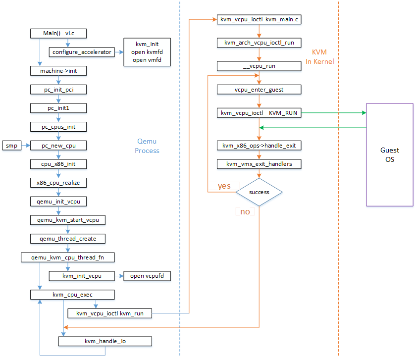

### 参数解析
启动qemu-system-x86_64应用程序，该程序入口为main(), 在main函数中第一阶段主要对命令传入的参数进行parser。

### VM的创建
通过configure_accelerator()->kvm_init() file: kvm-all.c
首先打开/dev/kvm，获得三大描述符之一kvmfd， 其次通过KVM_GET_API_VERSION进行版本验证，通过KVM_CREATE_VM创建了一个VM对象，返回了三大描述符之二: VM描述符/vmfd

### VM的初始化
通过加载命令的参数的解析和相关系统的初始化，找到对应的machine类型进行第三阶段的初始化：
其中的参数包括从命令行传入解析后得到的，ram的大小，内核镜像文件名，内核启动参数，initramdisk文件名，cpu模式等。
我们使用系统默认类型的machine，则init函数为pc_init_pci(),通过一系列的调用：
在命令行启动时配置的smp参数在这里启作用了，qemu根据配置的cpu个数，进行n次的cpu初始化，相当于n个核的执行体。

### VM RUN
可以看到VM真正的执行体是QEMU进程创建的一系列POSIX线程，而线程执行函数为qemu_kvm_cpu_thread_fn，kvm_init_vcpu()通过KVM_CREATE_VCPU创建了三大描述符之三：vcpu描述符/vcpufd，并进入了while(1)的循环循环，反复调用kvm_cpu_exec()。
在kvm_cpu_exec()中又是一个do()while(ret == 0)的循环体，该循环体中主要通过KVM_RUN启动VM的运行，从此处进入了kvm的内核处理阶段，并等待返回结果，同时根据返回的原因进行相关的处理，最后将处理结果返回。因为整个执行体在上述函数中也是在循环中，所以后续又会进入到该函数的处理中，而整个VM的cpu的处理就是在这个循环中不断的进行。

### Conclusion
总结下kvm run在Qemu中的核心流程：

1. 解析参数;
2. 创建三大描述符：kvmfd/vmfd/vcpufd，及相关的初始化，为VM的运行创造必要的条件；
3. 根据cpu的配置数目，启动n个POSIX线程运行VM实体，所以vm的执行环境追根溯源是在Qemu创建的线程环境中开始的。
4. 通过KVM_RUN调用KVM提供的API发起KVM的启动，从这里进入到了内核空间运行，等待运行返回；
5. 重复循环进入run阶段。

如图：

