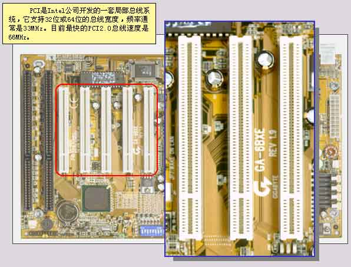

### PCI总线
PCI（Peripheral Component Interconnect）是外设互连总线的简是为了满足现代微机中的外部设备与主机之间的高速数据传输的需求而由美国Intel公司开发的总线标准。其适应性强、速度快 ，在Pentium以上的微型计算机被广泛采用。

如下图所示:

PCI总线不依附于某个具体处理器 ，它即可应用于Intel处理器系统中，也能应用于其他公司的处理器系统中。从结构上看，PCI是在CPU和原来的系统总线之间插入的另一级总线，具体由一个桥接电路实现对这一层的管理，并实现上下之间的接口以协调数据的传送。 桥接电路提供了信号缓冲，使之能支持多种外设，并能在高时钟频率下保持高性能。PCI总线也支持总线主控技术，允许智能设备在需要时取得总线控制权，以加速数据传送。

#### PCI总线的主要特点如下：
1. 高速、低延迟。PCI总线宽度 为32/64位，总线时钟频率33MHz/66MHz，最大数据传输速率528MB/s；
2. 同步传输方式；
3. 独立于处理器，与处理器频率无关 ，与处理器更新换代无关；
4. 自动识别外设，全自动配置与资源申请／分配（即插即用）；
5. 具有与处理器和存储器子系统完全并行操作的能力；
6. 具有隐含的集中式中央仲裁系统 ；
7. 采用地址线和数据线复用技术，减少了引线数量；
8. 支持一次读／写多个数据的Burst传输方式；
9. 完全的多总线主控能力；
10. 提供地址和数据的奇偶校验，使系统更可靠。 

PCI总线的体系结构如下图所示:

