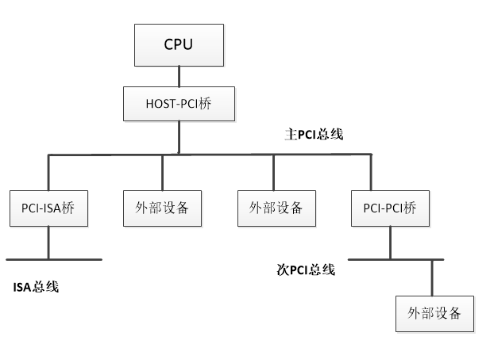
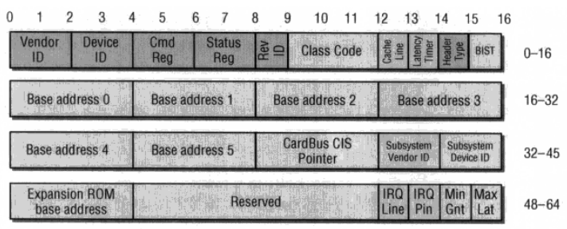
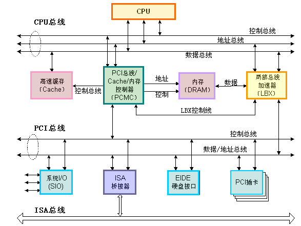

### PCI总线
PCI（Peripheral Component Interconnect）是外设互连总线的简是为了满足现代微机中的外部设备与主机之间的高速数据传输的需求而由美国Intel公司开发的总线标准。其适应性强、速度快 ，在Pentium以上的微型计算机被广泛采用。

如下图所示:

PCI总线不依附于某个具体处理器 ，它即可应用于Intel处理器系统中，也能应用于其他公司的处理器系统中。从结构上看，PCI是在CPU和原来的系统总线之间插入的另一级总线，具体由一个桥接电路实现对这一层的管理，并实现上下之间的接口以协调数据的传送。 桥接电路提供了信号缓冲，使之能支持多种外设，并能在高时钟频率下保持高性能。PCI总线也支持总线主控技术，允许智能设备在需要时取得总线控制权，以加速数据传送。

PCI总线上存在若干PCI设备插槽，当PCI插槽无法满足需求，就可以通过PCI桥扩展PCI设备，一个PCI桥把一个PCI总线连在一个PCI插槽上，作为PCI的一个设备。例如CPU通过“宿主-PCI桥与一条PCI总线相连，此总线成为“主PCI总线”，当通过PCI桥扩展PCI总线时，扩展的总线成为“从总线”，当然还可以通过其他的桥比如“PCI-ISA”桥扩展ISA总线，所以这样通过PCI-PCI桥可以构筑起一个层次的、树状的PCI系统结构，对于上层的总线而言，连接在这条总线上的PCI桥也是一个设备，但是这是一种特殊的设备。
其PCI树状结构如图所示：

一条PCI总线一般有32个接口，即可以连接32个PCI接口卡，而一个接口卡对应一个外部设备，注意这里的外部设备可以有多个功能（最多八个），每一个功能称为逻辑设备。每一个逻辑设备对应一个PCI配置空间。对于逻辑设备后面还会详细解释，这里先说配置空间的问题。PCI配置空间可以说是记录了关于此设备的详细信息。PCI配置空间最大256个字节，其中起先的64个字节的格式是预定义好的。当然并非所有的项都必须填充，位置是固定了，没有用到可以填充0。而前16个字节的格式是一定的。包含头部的类型、设备的总类、设备的性质以及制造商等。

PCi配置空间前64个字节格式如下：

需要注意的有一下几项：

ClassCode 用于将设备分到具体的功能组，该字段分为两部分，前8个bit表示基类即大类别，后8个比特表示基类的一个子类。比如PCI_BASE_CLASS_STORAGE表示大类大容量存储器，而PCI_CLASS_STORAGE_IDE表明这个IDE控制器。
HeaderType表明头部类型。一般区分为0型头部（PCI设备）1型头部（PCI桥），注意不同头部的配置空间格式有差异。这里我们主要先描述0型头部即普通PCi设备的配置空间。
PCI HeaderType为一个字节的大小，最高位为0表示单功能，最高位为1表示多功能（即前面描述的逻辑设备），单功能情况下一个PCI设备就是一个逻辑设备。低7位表示头部类型。
前16个字节都是一些基本的信息就不在多说，重点看下接下来的6个BAR空间。每个BAR记录了该设备映射的一段地址空间。为了区分IO空间和IO内存，这里我们分开描述：

当BAR最后一位为0表示这是映射的IO内存，为1是表示这是IO 端口，当是IO内存的时候1-2位表示内存的类型，bit 2为1表示采用64位地址，为0表示采用32位地址。bit1为1表示区间大小超过1M，为0表示不超过1M.bit3表示是否支持可预取。

而相对于IO内存，当最后一位为1时表示映射的IO地址空间。IO地址空间一般不支持预取，所以这里是29位的地址。

一般情况下，6个BAR是足够使用的，大部分情况都是3-4个BAR。而这些BAR映射的空间是连续的，即这些BAR共同描述设备的地址空间范围,除了6个基本的BAR空间们还有一个额外的配置ROM区间，区间最低位表示是否使用ROM区间，高21位表示地址。中间的是保留项。接下来需要注意的就是中断，因为大部分外设和系统交互就是通过中断的方式。

由配置空间中的IRQ Pin决定设备是否支持中断，1表示支持，0表示不支持。假如支持中断，IRQ Line表记录下中断号。

#### PCI总线的主要特点如下：
1. 高速、低延迟。PCI总线宽度 为32/64位，总线时钟频率33MHz/66MHz，最大数据传输速率528MB/s；
2. 同步传输方式；
3. 独立于处理器，与处理器频率无关 ，与处理器更新换代无关；
4. 自动识别外设，全自动配置与资源申请／分配（即插即用）；
5. 具有与处理器和存储器子系统完全并行操作的能力；
6. 具有隐含的集中式中央仲裁系统 ；
7. 采用地址线和数据线复用技术，减少了引线数量；
8. 支持一次读／写多个数据的Burst传输方式；
9. 完全的多总线主控能力；
10. 提供地址和数据的奇偶校验，使系统更可靠。

PCI总线的体系结构如下图所示:

## 参考
* [PCI设备](http://www.cnblogs.com/ck1020/p/5942703.html)
