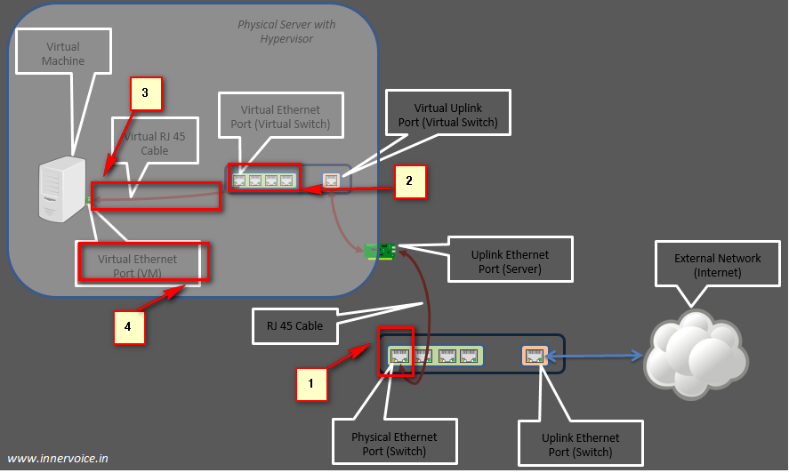

<<<<<<< HEAD
## Linux桥接模式
在计算机网络中，网桥作为一个网络设备应用也许并没有那么广泛。但是作为它的扩展---交换机就显得火的多了。交换机其本质就是相当于一个多端口的网桥，大多数交换机是工作在数据链路层即L2层，但目前三层交换机也逐步浮出水面。在本片文章中我们说讨论的仅仅是普通的二层交换机。
交换机既然工作在链路层，那么其必定要比工作在物理层的集线器高明一点。即其转发是基于帧的转发，交换机可以提取到每个帧 的源MAC和目的MAC，并且其本身会维护一个转发表，表内包含有MAC地址和其相应端口的映射。交换机收到一个帧之后的处理流程如下：
1. 每当交换机收到一个帧，就提取出帧的源MAC，然后查找转发表，表中若没有这一项，就把该地址和进入的端口写入转发表，若存在，就更新!
2. 然后提取目的MAC，查找转发表，表中若有对应的项，就从对应的端口转发出去，若没有，就从除了接受该帧的所有端口转发出去。

上面是对网桥（交换机基本原理的介绍），下面就谈谈LInux内核中对这一特性的支持。
首先在桥接模式下，网卡需要设置成混杂模式。即接收所有到达的数据包，不管目的地址是否是网卡的MAC。
在软件方面，就要依赖与Linux内核中的Tun/Tap驱动了。

### Tun/Tap驱动详解
Tun/Tap 用于虚拟网络设备，Tun虚拟网络层的设备，而Tap虚拟数据链路层的设备。所以Tun/Tap驱动提供一种功能,即可以通过这种驱动创建接口（Tun/Tap），通过这些接口可以在内核和用户空间传送网络数据包，其中Tun类型的接口可以传送IP数据包即从链路层交付上来的包，不包含以太网头。Tap接口可以传送以太网数据帧，就是链路层的包。
Tun/Tap驱动包含两个部分，一个是网卡驱动，一个是字符设备驱动。网卡驱动接收来自TCP/IP 协议栈的网络分包并发送或者反过来将接收到的网络分包传给协议栈处理；而字符驱动部分则将网络分包在内核与用户态之间传送，模拟物理链路的接收和发送。Tun/Tap 驱动的字符设备驱动部分向用户态暴漏了一个接口/dev/net/tun，其实是一个字符设备文件，用户空间的应用程序可以通过这个设备文件来和内核中的驱动程序进行交互，其操作方式和普通的文件操作无异。

连接一台交换机的PC机和外网交互的流程。一下几个条件是必须的：
1. 交换机上行端口--------用于连接外网
2. 交换机下行端口--------用于连接交换机下面的各个PC机
3. 网线
4. PC机（物理网卡）

外部数据通过交换机上行端口进入交换机，交换机工作在数据链路层，对数据帧提取MAC地址，首先进行地址学习后，就进行数据帧的转发，这里根据地址表中是否包含做出不同的选择，这不是重点，不在赘述。
然后数据帧通过网线到达PC机的物理网卡，然后系统就根据协议栈对数据包进行逐层处理最后交付了。

那么上述情况迁移到虚拟化环境下，即在一台LInux host上运行的虚拟机，如何通过LInux bridge上网？
其必要条件仍然有效，只不过需要采用另一种方式而已，见下图:

通过查看上图，我们不难发现，虽然迁移到了虚拟化的环境下，前面提到的四个条件依然存在
1. 上行网络接口--------这里表现为host的物理网卡，主要用以和外网交互
2. Tap接口---------这里就是虚拟出的网络设备，称之为Tap device,这里就是作为bridge的一个端口，连接虚拟机的虚拟网卡。
3. 虚拟网线---------这里主要表现为一个设备文件/dev/net/tun ,用户程序和Tap接口交互就是通过这个设备文件，从功能上来讲就是类似于一个网线。
4. 虚拟网卡----------这里就是从客户端的角度，一台虚拟机要发送和接收网络数据包必定需要虚拟网卡

Linux内部实现的bridge可以把一台机器上的多张网卡桥接起来，从而把自己作为一台交换机。同时，LInux bridge还支持虚拟端口，即桥接的不一定都是物理网卡接口，还可以是虚拟接口。目前主要表现为Tap接口，Tap接口在逻辑上和物理网卡实现相同的功能，都可以接收和发送数据包。

## 参考
[linux桥接模式一](http://www.cnblogs.com/ck1020/p/5889570.html)
[linux桥接模式二](http://www.cnblogs.com/ck1020/p/5893798.html)
[linux桥接模式三](http://www.cnblogs.com/ck1020/p/5894235.html)
=======

## 参考
[Linux下桥接模式详解一](http://www.cnblogs.com/ck1020/p/5889570.html)
>>>>>>> 9fe6a56afc5b347780048d97eb0a6ad5942b4bbe
