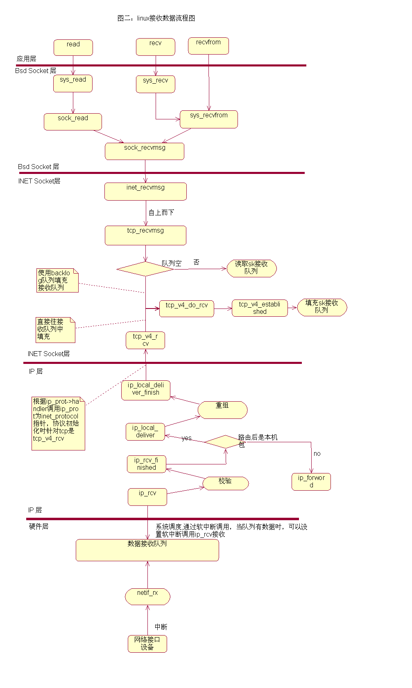

## 数据发送流程图

### 各层主要函数以及位置功能说明：

    1 sock_write：初始化msghdr{}结构 net/socket.c
    2 sock_sendmsg:net/socket.c
    3 inet_sendmsg:net/ipv4/af_net.c
    4 tcp_sendmsg：申请sk_buff{}结构的空间，把msghdr{}结构中的数据填入sk_buff空间。net/ipv4/tcp.c
    5 tcp_send_skb:net/ipv4/tcp_output.c
    6 tcp_transmit_skb:net/ipv4/tcp_output.c
    7 ip_queue_xmit:net/ipv4/ip_output.c
    8 ip_queue_xmit2:net/ipv4/ip_output.c
    9 ip_output:net/ipv4/ip_output.c
    10 ip_finish_output:net/ipv4/ip_output.c
    11 ip_finish_output2:net/ipv4/ip_output.c
    12 neigh_resolve_output:net/core/neighbour.c
    13 dev_queue_xmit:net/core/dev

## 数据接收流程图

各层主要函数以及位置功能说明：

 1)sock_read:初始化msghdr{}的结构类型变量msg，并且将需要接收的数据存放的地址传给msg.msg_iov->iov_base.      net/socket.c

 2)sock_recvmsg: 调用函数指针sock->ops->recvmsg()完成在INET Socket层的数据接收过程.其中sock->ops被初始化为inet_stream_ops,其成员recvmsg对应的函数实现为inet_recvmsg()函数. net/socket.c

 3)sys_recv()/sys_recvfrom():分别对应着面向连接和面向无连接的协议两种情况. net/socket.c

 4)inet_recvmsg:调用sk->prot->recvmsg函数完成数据接收,这个函数对于tcp协议便是tcp_recvmsg net/ipv4/af_net.c

 5)tcp_recvmsg:从网络协议栈接收数据的动作,自上而下的触发动作一直到这个函数为止,出现了一次等待的过程.函数tcp_recvmsg可能会被动地等待在sk的接收数据队列上,也就是说,系统中肯定有其他地方会去修改这个队列使得tcp_recvmsg可以进行下去.入口参数sk是这个网络连接对应的sock{}指针,msg用于存放接收到的数据.接收数据的时候会去遍历接收队列中的数据,找到序列号合适的.
 但读取队列为空时tcp_recvmsg就会调用tcp_v4_do_rcv使用backlog队列填充接收队列.

 6)tcp_v4_rcv:tcp_v4_rcv被ip_local_deliver函数调用,是从IP层协议向INET Socket层提交的"数据到"请求,入口参数skb存放接收到的数据,len是接收的数据的长度,这个函数首先移动skb->data指针,让它指向tcp头,然后更新tcp层的一些数据统计,然后进行tcp的一些值的校验.再从INET Socket层中已经建立的sock{}结构变量中查找正在等待当前到达数据的哪一项.可能这个sock{}结构已经建立,或者还处于监听端口、等待数据连接的状态。返回的sock结构指针存放在sk中。然后根据其他进程对sk的操作情况,将skb发送到合适的位置.调用如下:
 TCP包接收器(tcp_v4_rcv)将TCP包投递到目的套接字进行接收处理. 当套接字正被用户锁定,TCP包将暂时排入该套接字的后备队列(sk_add_backlog).这时如果某一用户线程企图锁定该套接字(lock_sock),该线程被排入套接字的后备处理等待队列(sk->lock.wq).当用户释放上锁的套接字时(release_sock,在tcp_recvmsg中调用),后备队列中的TCP包被立即注入TCP包处理器(tcp_v4_do_rcv)进行处理,然后唤醒等待队列中最先的一个用户来获得其锁定权. 如果套接字未被上锁,当用户正在读取该套接字时, TCP包将被排入套接字的预备队列(tcp_prequeue),将其传递到该用户线程上下文中进行处理.如果添加到sk->prequeue不成功,便可以添加到 sk->receive_queue队列中(用户线程可以登记到预备队列,当预备队列中出现第一个包时就唤醒等待线程.)   /net/tcp_ipv4.c

 7)ip_rcv、ip_rcv_finish:从以太网接收数据，放到skb里，作ip层的一些数据及选项检查，调用ip_route_input()做路由处理,判断是进行ip转发还是将数据传递到高一层的协议.调用skb->dst->input函数指针,这个指针的实现可能有多种情况,如果路由得到的结果说明这个数据包应该转发到其他主机,这里的input便是ip_forward;如果数据包是给本机的,那么input指针初始化为ip_local_deliver函数./net/ipv4/ip_input.c

 8)ip_local_deliver、ip_local_deliver_finish:入口参数skb存放需要传送到上层协议的数据,从ip头中获取是否已经分拆的信息,如果已经分拆,则调用函数ip_defrag将数据包重组。然后通过调用ip_prot->handler指针调用tcp_v4_rcv(tcp)。ip_prot是inet_protocol结构指针,是用来ip层登记协议的，比如由udp,tcp,icmp等协议。 /net/ipv4/ip_input.c
